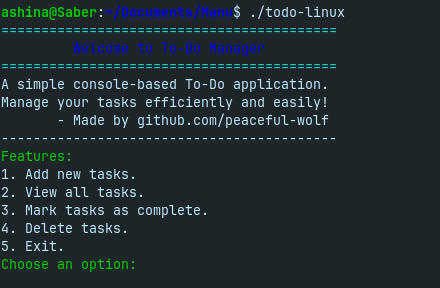
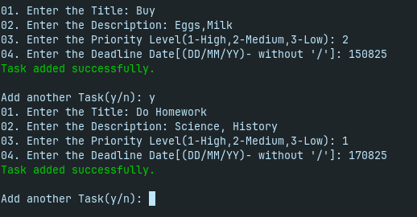
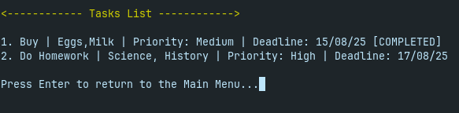
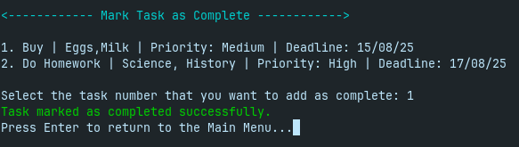
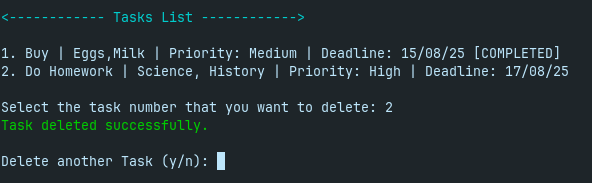

# 📝 To-Do Manager (C Console App)

A simple, colorized **console-based To-Do list manager** written in C.  
Create, view, complete, and delete tasks — all from your terminal.

---


---

## 🚀 Features

- ✅ **Add Tasks** – with title, description, priority, and deadline  
- 📋 **View Tasks** – cleanly listed in the terminal  
- ✔️ **Mark as Completed** – track what’s done  
- 🗑️ **Delete Tasks** – remove tasks easily  
- 🎨 **Colorized Output** – for better readability and user experience  

---

## 📷 Screenshot

<details>
<summary>📷 Click to view screenshots</summary>

## 📷 Feature Gallery



---

#### ➕ Add Tasks
Include title, description, deadline, and priority.


g
---

#### 📋 View All Tasks
Cleanly display all your current and completed tasks.



---

#### ✅ Mark as Completed
Track your progress by marking tasks as done.



---

#### 🗑️ Delete Tasks
Quickly remove tasks you no longer need.




</details>

---

## ⚙️ Build Instructions

Make sure you have **GCC** and **Make** installed.

```bash
git clone https://github.com/peaceful-wolf/todo-app.git
cd todo-app
make
./todo
```

## 🔽 Download Precompiled Binaries

> No need to compile — just run!

| Platform | Binary |
|----------|--------|
| 🐧 Linux  | [Download todo-linux](https://github.com/peaceful-wolf/todo-app/releases/latest) |
| 🪟 Windows | [Download todo.exe](https://github.com/peaceful-wolf/todo-app/releases/latest) |

## 💡 Suggest an Idea

- Have an idea or feature you'd like to see? Feel free to [open an issue](https://github.com/peaceful-wolf/todo-app/issues) with your suggestion or improvement!

## 👤 Author

- GitHub: [peaceful-wolf](https://github.com/peaceful-wolf)
- Project maintained by [peaceful-wolf](https://github.com/peaceful-wolf)
